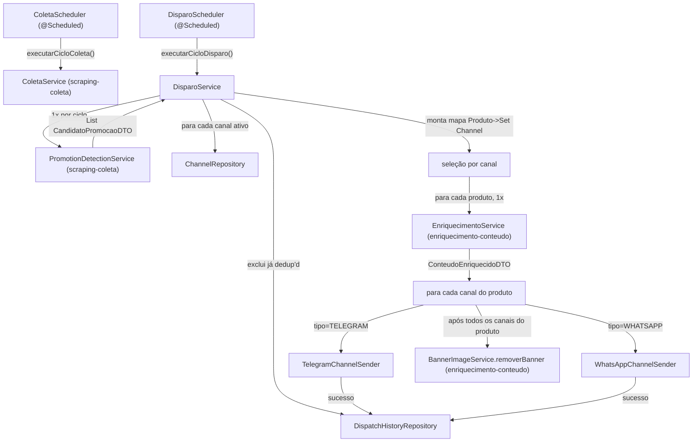

# Canais & Disparo Design

**Spec**: `.specs/features/canais-disparo/spec.md`
**Status**: Draft

---

## Architecture Overview

Esta é a feature que fecha o ciclo: lê `Channel` do banco, chama `PromotionDetectionService` (scraping-coleta) e `EnriquecimentoService`/`BannerImageService` (enriquecimento-conteudo) — ambos por chamada de método Java direta, D5 — e dispara via Telegram/Evolution API usando `RestClient` (D2).

### Ordem de execução: por que é "produto por fora, canal por dentro" mesmo a spec falando "para cada canal"

A spec (DISPATCH-09/10/11) descreve a seleção como "para cada canal ativo, filtrar/ordenar/selecionar" — o que é correto para a REGRA de seleção (cada canal decide sua própria lista, por suas próprias categorias aceitas e teto). Mas a EXECUÇÃO (enriquecer, enviar, limpar banner) não pode simplesmente iterar canal-por-fora, produto-por-dentro, porque isso violaria o contrato já fechado com `enriquecimento-conteudo`:

- Um mesmo produto pode ser selecionado por **mais de um canal** no mesmo ciclo (ex.: dois canais Telegram diferentes aceitando "MONITOR").
- `EnriquecimentoService.enriquecer(produto)` só pode ser chamado **uma vez** por produto por ciclo (ENRICH-02) — se o loop fosse canal-por-fora, o mesmo produto seria enriquecido de novo a cada canal que o selecionasse.
- `BannerImageService.removerBanner(path)` só pode ser chamado **depois que todos os canais elegíveis daquele produto já tentaram enviar** (ENRICH-08 AC4) — impossível saber isso enquanto ainda se está no meio do loop de um canal só.

Por isso a orquestração real é em duas passadas:

1. **Seleção (canal por fora, como a spec descreve)**: para cada canal ativo, filtra candidatos por categoria aceita + exclui já dedup'd + ordena por % desconto desc + pega o topo N. Resultado: um mapa `Produto → Set<Channel>` (a união de "quem vai receber o quê").
2. **Execução (produto por fora, canal por dentro)**: para cada produto desse mapa, enriquece uma vez, envia para cada canal do seu conjunto (com retry/isolamento por par produto×canal), e só então remove o banner.

O intervalo mínimo entre envios ao mesmo canal (DISPATCH-15/18) não depende da ordem do loop: cada envio dorme o intervalo configurado logo após ser feito, incondicionalmente. Como todo o ciclo já é sequencial (nenhuma concorrência, assumption do spec), isso garante pelo menos o intervalo mínimo entre quaisquer dois envios ao mesmo canal — uma garantia mais forte que o exigido (intervalo entre QUAISQUER dois envios, não só os do mesmo canal), o que é aceitável e mais simples do que rastrear o último envio por canal.

---

## Code Reuse Analysis

### Existing Components to Leverage

| Component | Location | How to Use |
| --- | --- | --- |
| `PromotionDetectionService.buscarCandidatosElegiveis()` | `service/` (feature `scraping-coleta`) | Chamado 1x por ciclo — ver Architecture Overview. Retorno já ajustado para `List<CandidatoPromocaoDTO>` (ver revisão registrada no design de `scraping-coleta`) |
| `EnriquecimentoService.enriquecer(Product)` / `BannerImageService.removerBanner(Path)` | `service/` (feature `enriquecimento-conteudo`) | Consumidos exatamente conforme o contrato já fechado (Integration Point daquele design) |
| `ConfigService` | `service/ConfigService.java` (feature `scraping-coleta`, AD-009) | Reusado sem alteração para `disparo.teto-produtos-por-canal`, `disparo.janela-dedup-dias`, `disparo.intervalo-entre-envios-segundos` |
| `RestClient` | bean padrão do `spring-boot-starter-webmvc` | Mesmo cliente HTTP já usado por `BannerImageService` (D2) |
| Padrão de isolamento por item (try/catch por unidade, log e segue) | `MonitorScheduler`/`BaseScraper` de referência, já replicado em `ColetaService` | Reaplicado aqui por canal e por par produto×canal |

### Integration Points

| Sistema | Método de integração |
| --- | --- |
| Telegram Bot API | `RestClient` → `https://api.telegram.org/bot{token}/sendPhoto` (multipart, arquivo local) e `.../sendMessage` (JSON) — confirmado via Context7 (docs oficiais Telegram Bot API) |
| Evolution API (WhatsApp) | `RestClient` → `POST /message/sendMedia/{instance}` e `POST /message/sendText/{instance}`, header `ApiKey: {chave}`, corpo JSON — confirmado via Context7 (docs oficiais Evolution API) |
| Feature `scraping-coleta` | `PromotionDetectionService.buscarCandidatosElegiveis()` (1x por ciclo — ver acima) |
| Feature `enriquecimento-conteudo` | `EnriquecimentoService.enriquecer(produto)` (1x por produto) + `BannerImageService.removerBanner(path)` (1x por produto, ao final) — contrato herdado, não redefinido aqui |

---

## Components

### `Channel` (entity)

- **Purpose**: Canal/grupo configurado para receber disparos.
- **Location**: `entity/Channel.java`
- **Campos**: `id`, `tipo` (enum `TipoCanal { TELEGRAM, WHATSAPP }` — **enum, não tabela**, ver Tech Decisions para o porquê, diferente de `CategoriaColeta`), `identificador` (String — `chat_id`/`@username` do Telegram, ou JID do grupo WhatsApp), `categoriasAceitas` (String — CSV de `CategoriaColeta.codigo`, ou literal `"ALL"`), `ativo` (boolean)
- **Reuses**: Mesmo padrão Lombok+JPA de `Product`/`CategoriaColeta`

### `DispatchHistory` (entity)

- **Purpose**: Registro de disparo bem-sucedido, base da deduplicação.
- **Location**: `entity/DispatchHistory.java`
- **Campos**: `id`, `product` (`@ManyToOne Product`), `channel` (`@ManyToOne Channel`), `enviadoEm` (`@PrePersist`)
- **Reuses**: Mesmo padrão de `PriceHistory`

### `ChannelRepository`, `DispatchHistoryRepository`

- **Location**: `repository/`
- **Interfaces**:
  - `ChannelRepository.findByAtivoTrue(): List<Channel>`
  - `DispatchHistoryRepository.existsByProductAndChannelAndEnviadoEmAfter(Product, Channel, LocalDateTime): boolean` — base de DISPATCH-20

### `DisparoService`

> **Revisão (2026-09-07, durante a escrita do `tasks.md` de `enriquecimento-conteudo` — gap ENRICH-07 encontrado no autoaudit cross-spec)**: `ConteudoEnriquecidoDTO` ganhou o campo `copyViaLlm` (ver revisão no design de `enriquecimento-conteudo`) especificamente para que esta feature possa satisfazer ENRICH-07 ("registrar, ao fim do ciclo, quantos produtos usaram copy LLM vs. template") — requisito que nenhum dos dois designs cobria antes. Passo 4 abaixo ganhou a contagem; passo 6 é novo.

- **Purpose**: Orquestrar um ciclo de disparo completo (seleção por canal + execução por produto, ver Architecture Overview).
- **Location**: `service/DisparoService.java`
- **Interfaces**:
  - `void executarCicloDisparo(): void`
- **Dependencies**: `PromotionDetectionService`, `ChannelRepository`, `DispatchHistoryRepository`, `EnriquecimentoService`, `BannerImageService`, `TelegramChannelSender`, `WhatsAppChannelSender`, `ConfigService`
- **Lógica** (resumo, a task de Execute detalha):
  1. `candidatos = promotionDetectionService.buscarCandidatosElegiveis()` — 1x
  2. Para cada canal ativo (`ChannelRepository.findByAtivoTrue()`): se `categoriasAceitas` vazio/nulo → WARN, pula (DISPATCH-26/edge case); senão filtra `candidatos` por categoria aceita, remove os com `DispatchHistoryRepository.existsByProductAndChannelAndEnviadoEmAfter(...)` dentro da janela, ordena por `percentualDesconto` desc, pega até o teto configurado — acumula em `Map<Product, Set<Channel>>`
  3. Se nenhum canal ativo → log INFO "nenhum canal ativo", encerra sem erro (edge case DISPATCH-25)
  4. Para cada `(produto, canais)` do mapa: `conteudo = enriquecimentoService.enriquecer(produto)`; incrementa um contador local (`copiasViaLlm`/`copiasViaTemplate`) conforme `conteudo.copyViaLlm()` (ENRICH-07); para cada canal desse conjunto: tenta enviar (com 1 retry imediato em falha), grava `DispatchHistory` só em sucesso, loga ERROR em falha final sem interromper os demais; dorme o intervalo configurado após cada tentativa (sucesso ou falha)
  5. Após todos os canais desse produto: se `conteudo.bannerPath() != null`, `bannerImageService.removerBanner(conteudo.bannerPath())`
  6. Ao final do ciclo (depois do loop do passo 4): loga INFO/WARN com a contagem total (`copiasViaLlm`, `copiasViaTemplate`) — satisfaz ENRICH-07

### `ChannelSender` (interface) + `TelegramChannelSender` + `WhatsAppChannelSender`

- **Purpose**: Encapsular o formato de payload específico de cada API externa — o suficiente para justificar a interface (2 implementações com payloads genuinamente diferentes: multipart vs. JSON+base64), sem virar um framework de plugins especulativo para tipos de canal que o PRD não previu.
- **Location**: `service/sender/ChannelSender.java`, `service/sender/TelegramChannelSender.java`, `service/sender/WhatsAppChannelSender.java`
- **Interfaces**: `void enviar(Channel canal, ConteudoEnriquecidoDTO conteudo) throws EnvioException`
- **`TelegramChannelSender`**:
  - Com banner (`conteudo.bannerPath() != null`): `POST https://api.telegram.org/bot{token}/sendPhoto`, multipart (`chat_id`, `photo` = arquivo local via `FileSystemResource`, content-type `image/jpeg` — banner é sempre `.jpg`/800×800/q0.85, contrato fixado no design de `enriquecimento-conteudo`; `caption` = copy) — upload multipart, não URL, porque o banner é um arquivo local (limite Telegram: 10 MB via multipart; um JPEG 800×800 a q0.85 fica na casa de dezenas de KB, muito abaixo disso)
  - Sem banner (modo texto puro): `POST .../sendMessage`, JSON (`chat_id`, `text` = copy)
  - Token via `telegram.bot.token` (env var, OPS-09)
  - Falha = qualquer status HTTP não-2xx ou corpo `{"ok": false, ...}` → `EnvioException`
- **`WhatsAppChannelSender`**:
  - Com banner: `POST {evolution.api.url}/message/sendMedia/{instance}`, header `ApiKey: {evolution.api.key}`, JSON (`number` = `canal.getIdentificador()`, `mediatype: "image"`, `mimetype: "image/jpeg"`, `fileName` = `"banner.jpg"`, `media` = **conteúdo do banner em Base64** — não URL, porque a instância da Evolution API não tem acesso ao filesystem local do bot; `caption` = copy)
  - Sem banner: `POST .../message/sendText/{instance}`, JSON (`number`, `text` = copy)
  - `instance`, URL e chave via env vars (`evolution.api.url`, `evolution.api.key`, `evolution.api.instance`, OPS-09)
  - Falha = qualquer status HTTP não-2xx → `EnvioException`. HTTP 201 com `status: "PENDING"` no corpo (padrão observado na doc da Evolution API) é tratado como **sucesso da chamada** — este disparo só confirma que a API aceitou a mensagem para envio, não que ela foi entregue ao destinatário; DISPATCH-19 ("histórico... de envio bem-sucedido") é interpretado como "API respondeu com sucesso", não como confirmação de entrega, já que a Evolution API não expõe isso de forma síncrona nesse endpoint

### `EnvioException` (unchecked)

- **Purpose**: Sinalizar falha de envio (qualquer canal) para o retry único do `DisparoService`.
- **Location**: `service/sender/EnvioException.java`
- **Reuses**: Nenhum — necessário porque `RestClient` já lança exceção em HTTP 4xx/5xx (`RestClientResponseException`), mas os dois senders precisam de um tipo comum para o `DisparoService` tratar igual independentemente do canal

---

## Config (reusa `app_config`, AD-009)

| Chave | Valor padrão | Uso |
| --- | --- | --- |
| `disparo.teto-produtos-por-canal` | `5` | DISPATCH-11 |
| `disparo.janela-dedup-dias` | `7` | DISPATCH-20 |
| `disparo.intervalo-entre-envios-segundos` | `2` | DISPATCH-15/18 |

**Não vão para `app_config`** (credenciais/estrutural, env vars per OPS-09): `telegram.bot.token`, `evolution.api.url`, `evolution.api.key`, `evolution.api.instance`.

**Cron de coleta/disparo**: `@Value`/propriedade (`coleta.cron`, `disparo.cron`), **não** `app_config` — ver Tech Decisions.

---

## Error Handling Strategy

| Error Scenario | Handling | User Impact |
| --- | --- | --- |
| Canal com tipo inválido (não TELEGRAM/WHATSAPP) | `DisparoService` ignora, loga WARN (DISPATCH-04) | Canal simplesmente não recebe nada |
| Categorias aceitas vazias/nulas | `DisparoService` ignora o canal, loga WARN (DISPATCH-26) | Idem |
| Nenhum canal ativo | Loga INFO, encerra ciclo sem erro (DISPATCH-25) | Nenhum |
| Nenhum candidato elegível para um canal | Pula o canal nesse ciclo, sem erro (DISPATCH-12) | Nenhum |
| Envio falha (HTTP erro/timeout) | 1 retry imediato; se falhar de novo, log ERROR, sem gravar `DispatchHistory`, produto elegível no próximo ciclo (DISPATCH-22/23) | Promoção não se perde, só atrasa |
| Scheduler de disparo ainda rodando quando o próximo horário chega | Nova execução é pulada, log WARN (DISPATCH-08) | Ciclo simplesmente não roda duas vezes em paralelo |

---

## Risks & Concerns

| Concern | Location (file:line) | Impact | Mitigation |
| --- | --- | --- | --- |
| Formato exato do corpo de erro do Telegram (`{"ok": false, "error_code":.., "description":..}`) não foi confirmado via Context7 nesta sessão — é conhecimento geral estável da API, não fabricado, mas sem citação direta da doc oficial consultada agora | `TelegramChannelSender` (a ser criado) | Se o formato mudou, a detecção de falha ainda funciona pelo status HTTP (`RestClientResponseException` em 4xx/5xx), só a mensagem de log seria menos precisa | Não bloqueia — falha ainda é detectada pelo status HTTP, independente do corpo. Conferir o corpo real na Tasks phase ao implementar o parse do log de erro |
| Evolution API: campo `media` aceita Base64 conforme a doc, mas o tamanho máximo de payload JSON aceito pela instância (proxy, load balancer) não foi confirmado — um banner muito grande poderia ser rejeitado antes mesmo de chegar à Evolution API | `WhatsAppChannelSender` (a ser criado) | Envio ao WhatsApp falhar por tamanho, mesmo com a lógica de retry/isolamento funcionando corretamente | **Mitigado pelo tamanho fixado em `enriquecimento-conteudo`** (800×800px, JPEG q0.85, Base64 inflando ~33% sobre um arquivo já pequeno — dezenas de KB) — resíduo de risco muito baixo; se algum proxy específico do operador tiver um teto de payload menor que isso, é ajuste de infraestrutura dele, não de arquitetura |
| `DisparoService` acumula em memória um `Map<Product, Set<Channel>>` por ciclo — sem limite explícito | `DisparoService` (a ser criado) | Irrelevante no volume do v1 (5 categorias, poucos canais, teto de 5 produtos/canal) — mencionado só por completude | Nenhuma mitigação necessária nesse volume |

---

## Tech Decisions (only non-obvious ones)

| Decision | Choice | Rationale |
| --- | --- | --- |
| `Channel.tipo`: enum Java vs. entidade configurável (como `CategoriaColeta`) | **Enum** `TipoCanal { TELEGRAM, WHATSAPP }` | Diferente de categoria: adicionar um novo TIPO de canal sempre exige código novo (um `ChannelSender` inteiro, payload e API diferentes) — não é uma config de dado, é uma integração nova. O5 (categoria sem código) não se aplica aqui; O4 (canal sem código) já está garantido pelo `Channel` ser uma tabela — só o `tipo` dentro dela é fechado nos 2 valores que o PRD define |
| Ordem de execução: canal-por-fora (como a spec descreve a seleção) vs. produto-por-fora (como a execução realmente precisa ser) | Duas passadas: seleção canal-por-fora, execução produto-por-fora | Único jeito de honrar o contrato já fechado com `enriquecimento-conteudo` (enriquecer 1x, limpar banner só ao final) sem duplicar produtos entre canais — ver Architecture Overview |
| Intervalo entre envios: rastrear "último envio por canal" vs. dormir um intervalo fixo após cada envio | Dormir o intervalo configurado após cada envio, incondicionalmente | Ciclo já é sequencial (assumption do spec) — dormir sempre é uma garantia mais forte e mais simples que rastrear timestamp por canal, sem violar o requisito (que pede um mínimo, não um máximo) |
| Envio para WhatsApp: `media` como URL pública vs. Base64 | Base64 do arquivo local | A Evolution API não tem acesso ao filesystem do bot; não há servidor de arquivos públicos no v1. Confirmado via Context7 que o campo `media` aceita Base64 |
| Mimetype/extensão do banner assumidos por esta feature | `image/jpeg` / `.jpg`, fixados no design de `enriquecimento-conteudo` (800×800, q0.85) após auditoria cross-feature | Levantado ao revisar se algum requisito DISPATCH-01..26 dependia de um dado não exposto pelas outras 2 features — este era o único gap real encontrado (o formato do arquivo do banner nunca tinha sido fixado). Resolvido nos dois designs simultaneamente, não só documentado como risco |
| Fetch de `Product.categoria` (usado para checar `categoriasAceitas` do canal) | Nenhuma mudança necessária — `@ManyToOne` é EAGER por padrão em JPA (spec da própria anotação), então `CandidatoPromocaoDTO.produto().getCategoria().getCodigo()` está disponível sem risco de `LazyInitializationException` mesmo fora da transação de origem | Conferido explicitamente durante a auditoria cross-feature desta revisão, para não ficar implícito |
| Envio para Telegram: `photo` via URL vs. multipart upload | Multipart upload (`FileSystemResource`) | Mesma razão — banner é um arquivo local, não uma URL pública. Confirmado via Context7 (limite de 10 MB via multipart, banner fica bem abaixo) |
| Cron de coleta/disparo: `app_config` (AD-009) vs. propriedade de ambiente | Propriedade de ambiente (`coleta.cron`, `disparo.cron`) | Diferente dos limiares numéricos (percentual, janela, teto): mudar um cron em runtime exigiria reagendar o `TaskScheduler` dinamicamente (complexidade real, não pedida) — cron é decisão operacional rara, tipicamente fixada no deploy, ao contrário de "quero testar 15% agora". `@Scheduled(cron = "${...}")` já resolve com um restart, proporcional à necessidade real |
| "Sucesso" de disparo para fins de `DispatchHistory` (DISPATCH-19) | HTTP 2xx da chamada à API externa, não confirmação de entrega ao destinatário | Nenhuma das duas APIs expõe confirmação síncrona de entrega neste endpoint — precisão adicionada à interpretação da spec, documentada aqui para não ficar ambígua na Tasks phase |
| `ChannelSender` como interface com 2 implementações | Sim, interface + Strategy simples (não Chain-of-Responsibility, não plugin registry) | Os 2 payloads são genuinamente diferentes (multipart vs. JSON+Base64) — justifica a interface; nada além disso é adicionado, já que o PRD não prevê um 3º tipo de canal |

> **Project-level**: nenhuma decisão nova além da aplicação de AD-009 (novas chaves) e do uso de `RestClient`/D2 (já decidido). Nenhuma nova entrada em `.specs/STATE.md` é necessária.

---

## Nota de execução

1. Migration Flyway própria desta feature (próximo número livre após `scraping-coleta`/`enriquecimento-conteudo`): tabelas `channel`, `dispatch_history` + seed das 3 chaves de `app_config` acima.
2. Adicionar `telegram.bot.token`, `evolution.api.url`, `evolution.api.key`, `evolution.api.instance`, `coleta.cron`, `disparo.cron` ao `.env.example` (feature `operacao-docker`, OPS-10).
3. **Não** adicionar nenhuma dependência nova ao `pom.xml` — `RestClient` já vem do `spring-boot-starter-webmvc`.
4. Esta feature também precisa **editar** `PromotionDetectionService` (feature `scraping-coleta`, já implementada antes desta) para o novo retorno `List<CandidatoPromocaoDTO>` — não é uma tabela nova, é uma alteração de assinatura em código já escrito, deve ser feita como parte da 1ª task desta feature, antes de qualquer código novo de `canais-disparo` que dependa dela.

## Auditoria cross-feature (todos os DISPATCH-01..26 contra os dados expostos por scraping-coleta/enriquecimento-conteudo)

Feita a pedido do usuário antes da aprovação, para não descobrir gaps só na Tasks phase. Resultado: **1 gap real encontrado e corrigido** (formato/mimetype do banner, não fixado antes — ver Tech Decisions), **1 ponto conferido e confirmado sem necessidade de mudança** (fetch EAGER de `Product.categoria`). Nenhum outro requisito DISPATCH-01..26 depende de dado que scraping-coleta ou enriquecimento-conteudo não exponham hoje:

- **Seleção/priorização (DISPATCH-01..12)**: usa `Channel` (própria desta feature), `CandidatoPromocaoDTO.percentualDesconto` (agora exposto) e `Product.categoria.codigo` (EAGER, confirmado) — cobertos.
- **Envio (DISPATCH-13..18)**: usa `ConteudoEnriquecidoDTO.copy()`/`bannerPath()` (já expostos pelo contrato fechado) e `Channel.identificador` (própria desta feature) — cobertos, com o mimetype/extensão do banner agora fixado.
- **Dedup (DISPATCH-19..21)**: usa `Product` (para a FK de `DispatchHistory`) e `Channel` — ambos já modelados, sem dado externo faltando.
- **Isolamento/retry (DISPATCH-22..24)** e **edge cases (DISPATCH-25..26)**: inteiramente internos a esta feature, sem dependência de dado externo.

> **Atualização (2026-09-07, durante a escrita do `tasks.md` de `enriquecimento-conteudo`)**: esta auditoria original não é de `canais-disparo` (ENRICH-07 é requisito de `enriquecimento-conteudo`), mas a implementação de ENRICH-07 só é possível com a colaboração desta feature (dona do "ciclo"). Um 2º gap cross-feature apareceu depois desta auditoria: `ConteudoEnriquecidoDTO` não threadava a origem da copy (LLM vs. template) até esta revisão. Corrigido — ver `DisparoService`, passos 4 e 6 acima.
