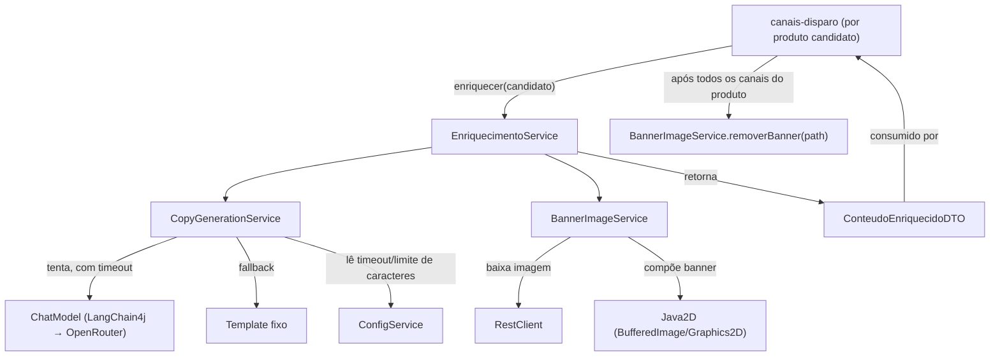

# Enriquecimento de Conteúdo Design

**Spec**: `.specs/features/enriquecimento-conteudo/spec.md`
**Status**: Draft

---

## Architecture Overview

Assim como `scraping-coleta`, esta feature expõe um único ponto de entrada consumido por `canais-disparo`, como chamada de método Java direta (D5 — sem fila, sem HTTP interno):

- `EnriquecimentoService.enriquecer(CandidatoPromocaoDTO candidato): ConteudoEnriquecidoDTO` — chamado **uma vez por produto candidato**, no início do processamento desse produto no ciclo de disparo, antes do loop sobre os canais elegíveis (garante ENRICH-02/ENRICH-09: copy e banner gerados uma vez, reusados por todos os canais).

> **Revisão (2026-09-07, durante a escrita do `tasks.md`)**: a assinatura original recebia só `Product`. ENRICH-01/ENRICH-08 exigem preço "de"/"por"/percentual na copy e no banner — e esse preço-base só existe no `CandidatoPromocaoDTO` que `PromotionDetectionService` já calculou (não é reconstruível de forma confiável a partir de `Product.precoRiscado`, que pode divergir do valor que realmente motivou a queda, ou ser `null`). Corrigido: recebe `CandidatoPromocaoDTO` (que já contém `produto`, `percentualDesconto` e `precoBase`, ver revisão em `scraping-coleta`/design.md) em vez de `Product` isolado. `canais-disparo` já tem esse DTO disponível desde `buscarCandidatosElegiveis()` — a mudança é threadá-lo até aqui em vez de descartá-lo cedo (ver nota de execução em `canais-disparo`/design.md, `DisparoService`).

Não há necessidade de nenhuma tabela nova para o resultado do enriquecimento: `ConteudoEnriquecidoDTO` é um objeto em memória, válido apenas durante o processamento daquele produto dentro do ciclo de disparo (que já é sequencial, um produto por vez — assumption já registrada no spec). Persistir isso não traria benefício e adicionaria uma tabela sem consumidor fora do próprio ciclo — por isso não há uma seção "approach exploration" com alternativas aqui: ao contrário da integração `scraping-coleta` ↔ `canais-disparo` (onde tabela vs. serviço era uma escolha real, decidida com você), aqui só existe uma forma sensata de fazer isso dado que D5 já fixa "sem fila, sem cache" e o ciclo já é sequencial.

### Decisão técnica: como o timeout do LLM respeita AD-009

`OpenAiChatModel` do LangChain4j aceita um `.timeout(Duration)` no builder do bean — mas isso fixaria o valor na construção do bean (só mudaria com restart), contrariando AD-009, que já lista explicitamente "timeout do LLM" como um limiar de negócio que deve ser ajustável sem redeploy. Decisão: o bean `ChatModel` **não** define timeout no builder; `CopyGenerationService` lê `enriquecimento.llm-timeout-segundos` do `ConfigService` a cada chamada e aplica o timeout na própria chamada.

**Como exatamente, e o que isso garante (e não garante) — revisado após pergunta do usuário:**

Duas formas foram consideradas para aplicar esse timeout por chamada:

1. **Embrulhar a chamada síncrona `chatModel.chat(prompt)` em `CompletableFuture.supplyAsync(...)` própria** (a primeira versão deste design) + `.get(timeout, TimeUnit.SECONDS)`. Isso só controla **o lado do chamador**: `CopyGenerationService` para de esperar e segue para o fallback, mas a chamada HTTP ao OpenRouter continua rodando em background na thread virtual até terminar (sucesso, erro ou o timeout do próprio HTTP client) — a resposta tardia é só descartada quando chega. Não há garantia de que o socket/requisição seja abortado.
2. **Usar a API assíncrona nativa do LangChain4j (`chatModel.chatAsync(...)`, que já retorna um `CompletableFuture`)** + `.orTimeout(...)`/`.get(timeout, ...)` chamando `.cancel(true)` no `catch`/timeout. Confirmado via Context7 (docs oficiais, seção "Getting one response without blocking"): "Cancelling this future releases the caller, halts further LLM processing, **and attempts to abort the underlying HTTP request**". Ou seja, esta opção genuinamente tenta abortar a chamada em andamento, não só abandona a espera.

**Decisão**: opção 2 (`chatAsync` + `cancel(true)`), por tentar abortar a requisição de verdade em vez de só desistir de esperar por ela.

**Limitação conhecida (documentada, não bloqueadora para o v1 — ver Risks & Concerns)**: a própria documentação do LangChain4j marca a API não-bloqueante (`chatAsync`) como **experimental, sujeita a mudança em versões futuras**; e "attempts to abort" não é uma garantia absoluta de abort em 100% das condições de rede — depende do cliente HTTP subjacente (`JdkHttpClient`/`OkHttpClient`/`ApacheHttpClient`, todos com suporte a `executeAsync` segundo a mesma documentação) realmente propagar o cancelamento até o socket. A assinatura exata de `chatAsync` para a versão fixada no `pom.xml` (`1.19.0`) não foi confirmada nesta sessão (Knowledge Verification Chain, passo 5) — precisa ser conferida na Tasks phase ao escrever `CopyGenerationService`. Se, na prática, `chatAsync` não suportar bem o modelo/endpoint do OpenRouter (alguns provedores retornam `AsyncNotSupportedException` na própria future), o fallback é reverter para a opção 1 (thread virtual + `supplyAsync`), aceitando a limitação de não abortar a chamada HTTP — o comportamento observável para o operador é idêntico (fallback por template dentro do timeout configurado); a diferença é só se a chamada ao OpenRouter continua consumindo rede/cota depois do timeout.

> **Correção (2026-09-07, durante a escrita do `tasks.md` — Knowledge Verification Chain aplicada antes de escrever a task de `CopyGenerationService`)**: a verificação pendente acima foi feita, extraindo e lendo diretamente o jar-fonte real de `langchain4j-core:1.19.0` (`ChatModel.java`, o mesmo módulo/versão fixados no `pom.xml`, sem ambiguidade). Resultado: **a interface `ChatModel` não declara nenhum método `chatAsync` nesta versão** — confirmado por busca exaustiva (0 ocorrências em 359 arquivos-fonte do módulo `langchain4j-core:1.19.0`). Os métodos existentes são só síncronos: `chat(ChatRequest)`, `chat(ChatRequest, ChatRequestOptions)`, `chat(String)`, `chat(ChatMessage...)`, `chat(List<ChatMessage>)`. A documentação do Context7 que descreve `chatAsync()`/`CompletableFuture` corresponde a uma versão mais nova do LangChain4j do que a fixada neste projeto — não é a mesma API.
>
> Como o próprio design já previa exatamente este cenário ("se `chatAsync` não se comportar como esperado... o fallback é reverter para a opção 1"), a decisão passa a ser a **opção 1, definitivamente**: `CompletableFuture.supplyAsync(() -> chatModel.chat(prompt), Executors.newVirtualThreadPerTaskExecutor())` + `.get(timeout, TimeUnit.SECONDS)`; em `TimeoutException`/`InterruptedException`, cancela a future (`future.cancel(true)`, que interrompe a thread virtual mas **não** aborta a conexão HTTP em andamento — mesma limitação já aceita nesta seção) e cai para `montarCopyTemplate`. O comportamento observável para o operador continua idêntico ao planejado: dentro do timeout configurado, o disparo sempre segue (LLM ou fallback), nunca trava.

---

## Code Reuse Analysis

### Existing Components to Leverage

| Component | Location | How to Use |
| --- | --- | --- |
| `Product` (entity) | `entity/Product.java` (feature `scraping-coleta`) | Fonte de título, preços, categoria, URL da imagem/produto — nenhuma duplicação de dado |
| `ConfigService` | `service/ConfigService.java` (feature `scraping-coleta`, AD-009) | Reusado sem alteração para ler `enriquecimento.llm-timeout-segundos`, `enriquecimento.limite-caracteres-copy`, `enriquecimento.selo-menor-preco-dias` — nenhum método novo precisa ser adicionado (já existem `getInt`/`getLong`) |
| `PriceHistoryRepository` | `repository/PriceHistoryRepository.java` (feature `scraping-coleta`) | Reusado pelo selo "menor preço em N dias" (P3) — adiciona 1 método (`findMenorPrecoDesde`), ver Components |
| `RestClient` (mesmo cliente HTTP que `canais-disparo` usará para Telegram/Evolution API — D2; requer `spring-boot-starter-restclient`, ver nota de execução — **não** vem de `spring-boot-starter-webmvc`) | Injetado (`RestClient.Builder`) no `BannerImageService` | Reusa o mesmo padrão de HTTP client do projeto em vez de introduzir `java.net.http.HttpClient` ou outra lib |

### Integration Points

| Sistema | Método de integração |
| --- | --- |
| OpenRouter (LLM free) | LangChain4j `OpenAiChatModel` apontando `baseUrl` para o endpoint do OpenRouter — API compatível com OpenAI, confirmado via Context7 (docs oficiais LangChain4j, seção "OpenAI-compatible") |
| Feature `scraping-coleta` | Leitura direta de `Product` (JPA, já gerenciado por aquela feature) e reuso de `ConfigService`/`PriceHistoryRepository` — mesmo monolito, sem novo contrato |
| Feature `canais-disparo` | **Contrato exato que o design de `canais-disparo` precisa honrar** (ENRICH-02/07/08/09/12/13):  1. Para cada produto candidato (`CandidatoPromocaoDTO`, já obtido de `promotionDetectionService.buscarCandidatosElegiveis()` — **não descartar antes de chegar aqui**, ver revisão acima), chamar `ConteudoEnriquecidoDTO conteudo = enriquecimentoService.enriquecer(candidato)` **exatamente uma vez**, antes de iniciar o loop sobre os canais elegíveis daquele produto.  2. Reusar o mesmo `conteudo` (mesma copy, mesmo `bannerPath`) para **todos** os canais elegíveis desse produto neste ciclo — nunca chamar `enriquecer()` de novo por canal.  3. Se `conteudo.bannerPath() == null` → produto está em modo texto puro: Telegram usa `sendMessage` (não `sendPhoto`), WhatsApp manda só texto (DISPATCH-14/canal). Se não for `null` → usa `sendPhoto`/mídia normalmente com esse arquivo.  4. Chamar `bannerImageService.removerBanner(conteudo.bannerPath())` **exatamente uma vez por produto** (só se `bannerPath() != null`), **depois que a última tentativa de envio a TODOS os canais elegíveis daquele produto tiver terminado** — seja com sucesso, seja com falha final após o retry (DISPATCH-22/23). Nunca remover entre um canal e outro do mesmo produto: o mesmo arquivo é reusado pelos canais seguintes.  5. Acumular `conteudo.copyViaLlm()` (true/false) por produto processado e logar a contagem total ao final do ciclo (ENRICH-07). |

---

## Components

### `EnriquecimentoService`

- **Purpose**: Orquestrar a geração de copy + banner de um produto candidato, uma única vez, montando o pacote reusado por todos os canais.
- **Location**: `src/main/java/com/jchristian/bot_amazon_spring/service/EnriquecimentoService.java`
- **Interfaces**:
  - `ConteudoEnriquecidoDTO enriquecer(CandidatoPromocaoDTO candidato): ConteudoEnriquecidoDTO` — chama `copyGenerationService.gerarCopy(candidato)` (retorna `CopyResultadoDTO`) e `bannerImageService.gerarBanner(candidato)`, monta `new ConteudoEnriquecidoDTO(resultado.texto(), bannerPath.orElse(null), resultado.viaLlm())`
- **Dependencies**: `CopyGenerationService`, `BannerImageService`
- **Reuses**: Nenhum código local além dos dois services abaixo

### `CopyGenerationService`

> **Revisão (2026-09-07)**: retorno mudou de `String` para `CopyResultadoDTO(String texto, boolean viaLlm)` — necessário para que `EnriquecimentoService` saiba a origem da copy e a propague em `ConteudoEnriquecidoDTO.copyViaLlm` (fix do gap ENRICH-07, ver revisão em `ConteudoEnriquecidoDTO` acima).

- **Purpose**: Gerar a copy em pt-BR (via LLM, com fallback por template), sempre com o link de afiliado presente, respeitando o limite de caracteres, e indicar a origem da copy.
- **Location**: `src/main/java/com/jchristian/bot_amazon_spring/service/CopyGenerationService.java`
- **Interfaces**:
  - `CopyResultadoDTO gerarCopy(CandidatoPromocaoDTO candidato): CopyResultadoDTO` — usa `candidato.produto()` (título, URL do produto), `candidato.precoBase()` ("de") e `candidato.produto().getPrecoAtual()` ("por"), `candidato.percentualDesconto()` (percentual — mesmo valor que motivou a detecção, nunca recalculado); tenta o LLM via `CompletableFuture.supplyAsync(() -> chatModel.chat(prompt), executor-de-threads-virtuais)` com timeout aplicado via `.get(timeout, ...)` (ver Architecture Overview — `chatAsync` não existe na versão fixada do LangChain4j); em qualquer falha/timeout, cai para `montarCopyTemplate` (`viaLlm=false`); sempre insere/reinsere o link de afiliado (`candidato.produto().getUrlProduto() + "?tag=" + tagAfiliado`, `tagAfiliado` vindo de propriedade de ambiente, per OPS-09 — **não** de `app_config`, é credencial/config de infraestrutura, não limiar de negócio); trunca preservando o link íntegro se exceder `enriquecimento.limite-caracteres-copy`
  - `private String montarCopyTemplate(CandidatoPromocaoDTO candidato): String` — título + "De: R$X / Por: R$Y (-Z%)" (`precoBase`/`precoAtual`/`percentualDesconto` do candidato) + link de afiliado, sem chamar o LLM
- **Dependencies**: `ChatModel` (bean LangChain4j), `ConfigService`, propriedade `afiliado.tag`
- **Reuses**: `ConfigService` (AD-009)

### `CopyResultadoDTO`

- **Purpose**: Carregar, junto com a copy gerada, a origem (LLM ou template) — usado só internamente entre `CopyGenerationService` e `EnriquecimentoService` (não é exposto a `canais-disparo`, que só vê `ConteudoEnriquecidoDTO`).
- **Location**: `src/main/java/com/jchristian/bot_amazon_spring/dto/CopyResultadoDTO.java`
- **Interfaces**: `record CopyResultadoDTO(String texto, boolean viaLlm)`
- **Dependencies**: Nenhuma
- **Reuses**: Nenhum

### `BannerImageService`

- **Purpose**: Baixar a imagem do produto e compor o banner (foto + % desconto + preço de/por [+ selo "menor preço", P3]); gerenciar o ciclo de vida do arquivo temporário.
- **Location**: `src/main/java/com/jchristian/bot_amazon_spring/service/BannerImageService.java`
- **Interfaces**:
  - `Optional<Path> gerarBanner(CandidatoPromocaoDTO candidato): Optional<Path>` — baixa `candidato.produto().getUrlImagem()` via `RestClient`; se falhar ou o conteúdo não for uma imagem válida (`ImageIO.read` retorna `null`), retorna `Optional.empty()` (sinaliza modo texto puro, ENRICH-08 AC3); senão compõe o banner via Java2D sobrepondo `candidato.percentualDesconto()`, `candidato.precoBase()` ("de") e `candidato.produto().getPrecoAtual()` ("por") — mesmos valores que motivaram a detecção — e grava em arquivo temporário **no formato e resolução fixados abaixo**, retornando seu `Path` (sempre extensão `.jpg`)
  - `void removerBanner(Path bannerPath): void` — apaga o arquivo; chamado por `canais-disparo` após concluir todos os canais do produto (ENRICH-08 AC4)
- **Formato e resolução do arquivo gerado (contrato cross-feature — `canais-disparo` depende disso para montar o payload de cada API, ver Tech Decisions)**: canvas quadrado **800×800px**, `ImageIO.write(canvas, "jpg", file)`, qualidade JPEG **0.85**. Arquivo sempre `.jpg` / `image/jpeg` — nunca PNG.
- **Dependencies**: `RestClient`, `ConfigService` (para o selo "menor preço", P3), `PriceHistoryRepository` (idem)
- **Reuses**: `RestClient` (mesmo cliente HTTP do resto do projeto), `PriceHistoryRepository` (feature `scraping-coleta`, +1 método novo, ver abaixo)

### `ChatModel` (bean de configuração)

- **Purpose**: Prover o cliente LangChain4j apontando para o OpenRouter.
- **Location**: `src/main/java/com/jchristian/bot_amazon_spring/config/LlmConfig.java`
- **Interfaces**: `@Bean ChatModel chatModel(...)` — `OpenAiChatModel.builder().baseUrl(${openrouter.base-url}).apiKey(${openrouter.api-key}).modelName(${openrouter.model}).build()`, **sem** `.timeout(...)` no builder (ver Architecture Overview)
- **Dependencies**: `langchain4j-open-ai` (já no `pom.xml`)
- **Reuses**: Nenhum

### `PriceHistoryRepository` (extensão, feature `scraping-coleta`)

- **Purpose**: +1 método para suportar o selo "menor preço em N dias" (P3).
- **Location**: `repository/PriceHistoryRepository.java` (arquivo já existente, criado por `scraping-coleta`)
- **Interfaces**: `@Query MIN(preco)` — `findMenorPrecoDesde(Product produto, LocalDateTime desde): Optional<BigDecimal>`
- **Dependencies**: Spring Data JPA
- **Reuses**: Interface existente — só adiciona um método, não altera os já definidos por `scraping-coleta`

### `ConteudoEnriquecidoDTO`

> **Revisão (2026-09-07, durante a escrita do `tasks.md` — gap encontrado no autoaudit cross-spec)**: ENRICH-07 exige registrar, ao final de cada ciclo de disparo, quantos produtos usaram copy LLM vs. template. Nem este design nem o de `canais-disparo` (dono do conceito de "ciclo") threadavam esse sinal — `enriquecimento-conteudo` processa um produto por vez, sem noção de ciclo, e não tinha como contar nada; `canais-disparo` não recebia nenhum dado do `ConteudoEnriquecidoDTO` que dissesse a origem da copy. Corrigido adicionando `boolean copyViaLlm` ao DTO (decisão confirmada com o usuário: booleano simples, não enum — só 2 origens existem no v1, um enum seria over-engineering). `canais-disparo` consome esse campo para agregar e logar ao fim do ciclo (nota de execução adicionada ao design daquela feature também).

- **Purpose**: Carregar o resultado do enriquecimento (copy + caminho do banner, se houver + origem da copy) entre `EnriquecimentoService` e `canais-disparo`.
- **Location**: `src/main/java/com/jchristian/bot_amazon_spring/dto/ConteudoEnriquecidoDTO.java`
- **Interfaces**: `record ConteudoEnriquecidoDTO(String copy, Path bannerPath, boolean copyViaLlm)` — `bannerPath == null` significa modo texto puro (ENRICH-12/13); `copyViaLlm` indica se a copy veio do LLM (`true`) ou do fallback por template (`false`), consumido por `canais-disparo` para a contagem de ENRICH-07
- **Dependencies**: Nenhuma
- **Reuses**: Nenhum (objeto em memória, nunca persistido — ver Architecture Overview)

---

## Config (sem entidade nova — reusa `app_config` de `scraping-coleta`, AD-009)

Nenhuma tabela nova. Esta feature semeia suas próprias chaves na tabela já existente `app_config` (mesma tabela, migration própria desta feature — ver Nota de execução):

| Chave | Valor padrão | Uso |
| --- | --- | --- |
| `enriquecimento.llm-timeout-segundos` | `15` | Timeout aplicado por chamada ao LLM (ver Architecture Overview) |
| `enriquecimento.limite-caracteres-copy` | `1024` | Limite de truncamento da copy (limite de legenda do Telegram) |
| `enriquecimento.selo-menor-preco-dias` | `90` | Janela do selo "menor preço em N dias" (P3) |

**Credenciais/infra (env vars, não `app_config` — já decidido em OPS-09)**: `openrouter.api-key`, `openrouter.base-url`, `openrouter.model`, `afiliado.tag`.

---

## Error Handling Strategy

| Error Scenario | Handling | User Impact |
| --- | --- | --- |
| LLM excede o timeout OU lança qualquer exceção (rate limit, indisponibilidade, resposta vazia) | `CopyGenerationService` captura, loga WARN com o motivo, usa `montarCopyTemplate` (ENRICH-04) | Disparo ocorre normalmente, com copy mais simples |
| Download da imagem falha (timeout, HTTP erro, URL inválida) | `BannerImageService` retorna `Optional.empty()`, loga WARN com ASIN e motivo | Produto vai para modo texto puro (ENRICH-12) |
| Conteúdo baixado não é uma imagem válida (`ImageIO.read` retorna `null`) | Mesmo tratamento do item acima | Idem |
| Copy final (LLM ou template) excede o limite de caracteres configurado | `CopyGenerationService` trunca preservando o link de afiliado íntegro no final | Copy mais curta, link sempre clicável |
| LLM omite ou altera o link de afiliado na resposta | `CopyGenerationService` sempre reinsere o link correto após receber a resposta do LLM, nunca confia no link que o LLM gerou | Nenhum — link sempre correto |

---

## Risks & Concerns

| Concern | Location (file:line) | Impact | Mitigation |
| --- | --- | --- | --- |
| Nome exato do modelo free do OpenRouter não foi verificado (modelos free mudam de disponibilidade com frequência) | `LlmConfig` (a ser criado) | Se o modelo configurado for descontinuado, toda chamada ao LLM falha até a config ser corrigida | `openrouter.model` é variável de ambiente (OPS-09), corrigível sem deploy de código; e mesmo falhando 100% das vezes, o fallback por template garante que o disparo não trava (ENRICH-05/06) |
| Cancelar o timeout do LLM não aborta a chamada HTTP em andamento — só libera `CopyGenerationService` da espera. `chatAsync()` (que "tentaria" abortar, segundo o Context7) **não existe em `langchain4j-core:1.19.0`** (confirmado lendo o jar-fonte real durante a Tasks phase) — a versão fixada só tem `chat()` síncrono; a opção 1 (`supplyAsync` + thread virtual + `.cancel(true)`) é usada, e `.cancel(true)` numa future de `supplyAsync` interrompe a thread virtual mas não aborta o socket HTTP subjacente | `CopyGenerationService` | Em pior caso, a chamada ao OpenRouter continua consumindo rede/cota do free-tier por até o timeout do próprio provedor, mesmo após `CopyGenerationService` já ter seguido pro fallback | Não bloqueia o v1 — o comportamento observável pro operador (disparo nunca trava, fallback sempre disponível) é o mesmo com ou sem abort efetivo. Esta é a única opção disponível na versão fixada; não há uma alternativa "melhor" a reverter para — se uma versão futura do LangChain4j adicionar `chatAsync` de verdade, revisitar então |
| Headers opcionais recomendados pelo OpenRouter (`HTTP-Referer`, `X-Title`, usados para atribuição/ranking, não confirmados como obrigatórios para o tier free) | `LlmConfig` | Nenhum impacto funcional conhecido; só afeta atribuição no painel do OpenRouter | Confirmado via Context7 que `customHeaders(Map.of(...))` existe no builder das variantes OpenAI-compatíveis do LangChain4j — se necessário, adicionar na Tasks phase; não bloqueia o funcionamento |
| Banner via Java2D nunca foi testado neste projeto (biblioteca nova de uso, não de dependência — `Graphics2D`/`ImageIO` são da JDK) | `BannerImageService` (a ser criado) | Layout do banner pode sair diferente do esperado na primeira tentativa | Sem mitigação de design necessária — é ajuste iterativo de implementação (posição/tamanho de texto), não uma decisão arquitetural; primeira execução deve ser inspecionada visualmente antes de aprovar a task |

---

## Tech Decisions (only non-obvious ones)

| Decision | Choice | Rationale |
| --- | --- | --- |
| Biblioteca de composição de imagem | Java2D puro (`BufferedImage`, `Graphics2D`, `ImageIO`) — nenhuma dependência nova | A necessidade é sobrepor texto/formas a uma imagem, não redimensionamento em lote — Java2D já resolve sem adicionar Thumbnailator ou outra lib ao `pom.xml` |
| Cliente HTTP para baixar a imagem do produto | `RestClient` (requer `spring-boot-starter-restclient` — **não** vem de `spring-boot-starter-webmvc`, ver Nota de execução) | Mesmo cliente que `canais-disparo` usará para Telegram/Evolution API (D2) — um único padrão de HTTP no projeto, em vez de introduzir `java.net.http.HttpClient` |
| Timeout do LLM: builder do LangChain4j vs. enforcement manual por chamada | Enforcement manual, lendo o valor do `ConfigService` a cada chamada | Único jeito de honrar AD-009 (timeout ajustável sem redeploy) — o builder do `OpenAiChatModel` fixaria o valor na construção do bean |
| Como aplicar esse timeout manual: embrulhar `chat()` síncrono em `CompletableFuture` própria vs. usar `chatAsync()` nativo do LangChain4j | `CompletableFuture.supplyAsync(() -> chatModel.chat(prompt), virtual-thread-executor)` + `.get(timeout, ...)` (opção 1) — **`chatAsync()` confirmado inexistente em `langchain4j-core:1.19.0`** (verificado lendo o jar-fonte real; a doc do Context7 descreve uma versão mais nova) | Única opção disponível na versão fixada no `pom.xml`. Não aborta a chamada HTTP em andamento (só libera o chamador) — limitação aceita, documentada em Risks & Concerns; comportamento observável pro operador é o mesmo (fallback sempre disponível dentro do timeout) |
| Onde mora o resultado do enriquecimento (copy + banner) | DTO em memória (`ConteudoEnriquecidoDTO`), nunca persistido | Ciclo de disparo já é sequencial e de curta duração; persistir criaria uma tabela sem consumidor além do próprio ciclo em andamento |
| Tag de afiliado: `app_config` vs. variável de ambiente | Variável de ambiente (`afiliado.tag`) | Já decidido em `operacao-docker` (OPS-09, "credenciais e endpoints externos... tag de afiliado" via env vars) — não reaberto aqui |
| Formato e resolução do banner: aberto para a Tasks phase vs. fixado agora | Fixado agora: **800×800px, JPEG, qualidade 0,85** | Levantado na revisão de `canais-disparo`: (1) sem um formato/mimetype explícito, `canais-disparo` teria que adivinhar o `mimetype`/extensão do arquivo que recebe — contrato cross-feature que não pode ficar implícito; (2) o payload da Evolution API é Base64 (~33% maior que o arquivo bruto) — JPEG a 0,85 reduz bastante o tamanho vs. PNG (que seria a alternativa óbvia para um banner com texto), sem perda perceptível numa foto de produto com poucas linhas de texto sobreposto |
| Resolução/qualidade do banner: `app_config` (AD-009) vs. propriedade de ambiente | Propriedade de ambiente / constante, **não** `app_config` | Mesma lógica já aplicada aos seletores CSS do scraper (`scraping-coleta`): é um parâmetro técnico de renderização, não um limiar de negócio que o operador queira testar ao vivo — mudar exige olhar o resultado visual, não só o número |

> **Project-level**: nenhuma decisão nova além do já registrado em AD-009 (que esta feature apenas aplica, semeando suas próprias chaves em `app_config`). Nenhuma nova entrada em `.specs/STATE.md` é necessária.

---

## Nota de execução

Esta feature **não** introduz nenhuma tabela nova — só novas linhas em `app_config` (já criada por `scraping-coleta`) e +1 método em `PriceHistoryRepository` (arquivo já existente). A Tasks phase desta feature deve:

1. Adicionar uma migration Flyway própria (`V2__seed_enriquecimento_config.sql` — `scraping-coleta` só criou `V1`) inserindo as 3 chaves da seção **Config** acima.
2. Adicionar `openrouter.api-key`, `openrouter.base-url`, `openrouter.model` e `afiliado.tag` ao `.env.example` (feature `operacao-docker`, OPS-10) — nenhuma dessas credenciais é inventada aqui, só referenciada; os valores reais ficam com você.
3. `langchain4j-open-ai` já está presente desde o scaffold inicial — não precisa ser adicionada.

> **Correção (2026-09-07, durante a escrita do `tasks.md`)**: a suposição original de que `RestClient` já estaria disponível via `spring-boot-starter-webmvc` (linha da seção Code Reuse Analysis) está **errada** para Spring Boot 4 — confirmado via Context7 (docs oficiais): `RestClient.Builder` é auto-configurado pelo módulo `spring-boot-restclient`, cujo starter correspondente (`spring-boot-starter-restclient`) **não** é trazido transitivamente por `spring-boot-starter-webmvc`. A Tasks phase desta feature deve adicionar `org.springframework.boot:spring-boot-starter-restclient` (escopo principal) e `org.springframework.boot:spring-boot-starter-restclient-test` (escopo teste, para `@RestClientTest`/`MockRestServiceServer`) ao `pom.xml` — sem versão explícita, herdada do BOM, mesmo padrão já usado para Flyway/Testcontainers em `scraping-coleta`. Timeout de conexão/leitura do download de imagem (ENRICH-11 "timeout") configurado via `spring.http.clients.connect-timeout`/`read-timeout` em `application.properties` (propriedade técnica fixa, não `app_config` — mesmo racional dos seletores CSS/resolução do banner, AD-009).
