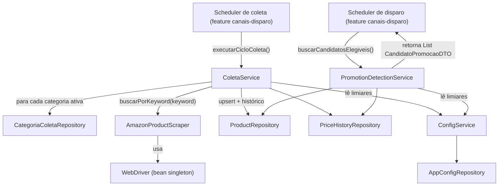

# Scraping & Coleta Design

**Spec**: `.specs/features/scraping-coleta/spec.md`
**Status**: Approved (arquitetura confirmada com o usuário em 2026-09-03)

---

## Architecture Overview

Esta é a primeira feature a introduzir persistência (JPA + Flyway, AD-007) e a primeira a rodar Selenium neste projeto. Ela expõe dois pontos de entrada consumidos por outras features, sem depender delas:

- `ColetaService.executarCicloColeta()` — chamado pelo scheduler de coleta que será definido na feature `canais-disparo` (D6/E6 já colocou os dois schedulers naquela feature).
- `PromotionDetectionService.buscarCandidatosElegiveis()` — chamado pelo scheduler/serviço de disparo da mesma feature `canais-disparo`, como uma chamada de método Java comum (mesmo monolito, D5 — sem fila, sem HTTP interno).

### Approach considerado: como expor candidatos a disparo

Duas abordagens foram avaliadas para a integração com `canais-disparo`:

| | **A — Serviço sob demanda (escolhida)** | **B — Tabela de fila persistida** |
| --- | --- | --- |
| Como funciona | `PromotionDetectionService` calcula os candidatos na hora, direto do `PriceHistory`, toda vez que é chamado | `ColetaService` grava uma linha em uma tabela `price_drop_candidate` a cada queda detectada; disparo só lê essa tabela |
| Entidades novas | Nenhuma | +1 entidade/tabela/migration, +1 campo de estado ("consumido") |
| Duplicação de lógica | Nenhuma — a regra de "o que é queda relevante" mora só no `scraping-coleta` | Nenhuma na leitura, mas exige sincronizar quando uma linha vira "obsoleta" (produto voltou a subir) |
| Acoplamento entre features | Chamada de método Java (`canais-disparo` depende do service público de `scraping-coleta`) | Acoplamento via schema (ambas as features leem/escrevem a mesma tabela) |

**Decisão (confirmada com o usuário)**: Approach A. Sem tabela nova; `PromotionDetectionService` é o único dono da regra de detecção, chamado sob demanda pelo `canais-disparo`. A idempotência de "não sinalizar o mesmo patamar de novo" (SCRAPE-11) é resolvida com um campo `lastCandidatoPreco` no próprio `Product`, atualizado como efeito colateral de `buscarCandidatosElegiveis()`.



---

## Code Reuse Analysis

Não há código local reaproveitável (repositório é um esqueleto vazio). O reaproveitamento vem do **padrão** do projeto de referência `jabes-christian/freelas-spring-boot-selenium` (D6) — inspecionado via GitHub para não fabricar interfaces. O domínio muda (Amazon em vez de Workana/99Freelas), a estrutura não.

### Padrões a seguir (mesma forma, domínio novo)

| Padrão de referência | Onde aplicar aqui | Adaptação |
| --- | --- | --- |
| `BaseScraper` (abstract, injeta `WebDriver` + `WebDriverWait`, expõe `navegarPara`/`aguardarElemento(s)`/`extrairTexto`/`extrairAtributo`/`elementoExiste`) | `scraper/base/BaseScraper.java` | Copiado quase igual — é infraestrutura Selenium genérica, não específica de domínio |
| Uma subclasse de scraper por fonte (`WorkanaScraper`, `FreelasScraper`) | **Não replicado 1:1** — ver Tech Decisions | Aqui as 5 categorias batem na mesma estrutura de página da Amazon; uma única classe parametrizada por keyword evita 5 subclasses quase idênticas |
| `SeleniumConfig` (bean `WebDriver`: local via WebDriverManager quando `selenium.remote.url` vazio, `RemoteWebDriver` quando preenchido) | **Escrito nesta feature** (`scraping-coleta`), não em `operacao-docker` — ver nota abaixo | Nenhuma adaptação de domínio necessária, reaproveitado quase igual ao do projeto de referência |
| DTO como `record` com construtor compacto validando campos obrigatórios + factory `of(...)` | `ScrapedProductDTO` | Mesmo padrão, campos do domínio Amazon |
| Entity com Lombok (`@Getter @Setter @NoArgsConstructor @AllArgsConstructor @Builder`) + `@PrePersist` para timestamp | `Product`, `PriceHistory`, `CategoriaColeta` | Mesmo padrão |
| Repository Spring Data com métodos derivados (`existsByLink`, `findByX`) | `ProductRepository`, `PriceHistoryRepository`, `CategoriaColetaRepository` | Mesmo padrão + 1 `@Query` para MIN(preço) |
| Scheduler que envolve cada execução em try/catch isolado, delega para a service layer | Reaproveitado pela feature `canais-disparo` (dona do scheduler) — `ColetaService.executarCicloColeta()` já nasce com esse isolamento por categoria internamente | O isolamento por categoria (SCRAPE-03/16) vive dentro do `ColetaService`, não only no scheduler, porque aqui uma única execução do ciclo cobre várias categorias (lá era um scraper por fonte) |

### Integration Points

| Sistema | Método de integração |
| --- | --- |
| Amazon (`amazon.com.br/s?k=...`) | Selenium via `AmazonProductScraper`, WebDriver bean (local ou remoto conforme `operacao-docker`) |
| Postgres | Spring Data JPA + Flyway (AD-007) — primeira feature a introduzir ambos no projeto |
| Feature `canais-disparo` | Chamada de método Java direta a `ColetaService.executarCicloColeta()` e `PromotionDetectionService.buscarCandidatosElegiveis()` — sem HTTP, sem fila (D5) |

---

## Components

### `AmazonProductScraper`

- **Purpose**: Buscar produtos na Amazon por palavra-chave e extrair os campos brutos de cada card de resultado.
- **Location**: `src/main/java/com/jchristian/bot_amazon_spring/scraper/AmazonProductScraper.java`
- **Interfaces**:
  - `List<ScrapedProductDTO> buscarPorKeyword(String keyword): List<ScrapedProductDTO>` — navega para `https://www.amazon.com.br/s?k={keyword}`, extrai cada card, filtra os inválidos (sem ASIN/preço)
- **Dependencies**: `WebDriver` (bean, injetado no construtor), `BaseScraper`
- **Reuses**: `BaseScraper` (helpers de espera/extração)

### `BaseScraper` (abstract)

- **Purpose**: Encapsular as operações comuns de Selenium (navegação, espera, extração de texto/atributo) usadas por qualquer scraper do projeto.
- **Location**: `src/main/java/com/jchristian/bot_amazon_spring/scraper/base/BaseScraper.java`
- **Interfaces**:
  - `protected void navegarPara(String url)`
  - `protected List<WebElement> aguardarElementos(By locator): List<WebElement>`
  - `protected String extrairTexto(By locator): String`
  - `protected String extrairAtributo(By locator, String atributo): String`
  - `protected boolean elementoExiste(By locator): boolean`
- **Dependencies**: `WebDriver`, `WebDriverWait`
- **Reuses**: Nenhum (é a própria base)

### `ColetaService`

- **Purpose**: Orquestrar um ciclo de coleta completo — uma categoria ativa por vez, sequencialmente, isolando falhas.
- **Location**: `src/main/java/com/jchristian/bot_amazon_spring/service/ColetaService.java`
- **Interfaces**:
  - `void executarCicloColeta(): void` — para cada `CategoriaColeta` ativa: chama o scraper, valida sanidade de preço, faz upsert do `Product`, grava `PriceHistory`; captura exceção por categoria (log ERROR) sem interromper as demais; aguarda o intervalo configurado entre categorias
- **Dependencies**: `AmazonProductScraper`, `CategoriaColetaRepository`, `ProductRepository`, `PriceHistoryRepository`, `ConfigService`
- **Reuses**: Nenhum código local; segue o padrão de isolamento por item do `MonitorScheduler` de referência, movido para dentro do service porque aqui uma execução cobre N categorias

### `PromotionDetectionService`

> **Revisão (durante o Design de `canais-disparo`)**: o retorno original desta interface era `List<Product>`. Ao desenhar `canais-disparo`, ficou claro que DISPATCH-10 ("ordenar candidatos por percentual de desconto decrescente") precisa desse percentual — e ele só existe no instante da detecção (é `(precoBase - precoAtual) / precoBase`; `precoBase` não fica armazenado em `Product`, e `lastCandidatoPreco` já é sobrescrito pelo valor novo antes do método retornar). Sem essa mudança, `canais-disparo` teria que recalcular a mesma regra de negócio por fora, duplicando-a. Retorno alterado para `List<CandidatoPromocaoDTO>`, chamado exatamente uma vez por ciclo de disparo (nunca uma vez por canal — ver design de `canais-disparo`, Architecture Overview).
>
> **Revisão 2 (2026-09-07, durante a escrita do `tasks.md` de `enriquecimento-conteudo`, feature já commitada/verificada sendo reaberta)**: ENRICH-01/ENRICH-08 exigem que a copy/banner mostrem preço "de" e "por", não só o percentual. `Product.precoRiscado` (a marcação "de/por" da própria página da Amazon) **não é a mesma coisa** que a base real usada por esta detecção uma vez que o produto tem ≥2 entradas de histórico (nesse caso a base é o mínimo do histórico, SCRAPE-10) — poderiam divergir, ou `precoRiscado` poderia estar `null` num produto flagado só via histórico. Para a copy/banner mostrarem exatamente o preço que motivou a promoção (nunca um valor divergente ou ausente), `CandidatoPromocaoDTO` ganha um 3º campo, `precoBase`, junto com o `percentualDesconto` já existente — mesmo valor, já calculado nesta task, sem custo adicional.

- **Purpose**: Determinar quais produtos têm queda de preço relevante, usando o histórico como fonte de verdade (D8) com fallback de cold start, retornando também o percentual de desconto e o preço-base calculados.
- **Location**: `src/main/java/com/jchristian/bot_amazon_spring/service/PromotionDetectionService.java`
- **Interfaces**:
  - `List<CandidatoPromocaoDTO> buscarCandidatosElegiveis(): List<CandidatoPromocaoDTO>` — para cada `Product`: calcula preço-base de comparação (mínimo do histórico se ≥ 2 entradas, senão `precoRiscado` se presente, senão pula o produto); se `precoAtual <= precoBase * (1 - percentualMinimo)` **e** `precoAtual != lastCandidatoPreco` → inclui `new CandidatoPromocaoDTO(product, percentualDesconto, precoBase)` no resultado e atualiza `lastCandidatoPreco = precoAtual`
- **Dependencies**: `ProductRepository`, `PriceHistoryRepository`, `ConfigService`
- **Reuses**: Nenhum

### `CandidatoPromocaoDTO`

- **Purpose**: Carregar, junto com o `Product`, o percentual de desconto e o preço-base calculados no momento da detecção — para `canais-disparo` ordenar/priorizar e para `enriquecimento-conteudo` montar copy/banner, sem recalcular a regra de negócio nem divergir do valor que motivou a promoção.
- **Location**: `src/main/java/com/jchristian/bot_amazon_spring/dto/CandidatoPromocaoDTO.java`
- **Interfaces**: `record CandidatoPromocaoDTO(Product produto, BigDecimal percentualDesconto, BigDecimal precoBase)`
- **Dependencies**: Nenhuma
- **Reuses**: Nenhum

### `CategoriaColetaRepository`, `ProductRepository`, `PriceHistoryRepository`

- **Purpose**: Acesso a dados via Spring Data JPA.
- **Location**: `src/main/java/com/jchristian/bot_amazon_spring/repository/`
- **Interfaces**:
  - `CategoriaColetaRepository.findByAtivoTrue(): List<CategoriaColeta>`
  - `ProductRepository.findByAsin(String asin): Optional<Product>`
  - `PriceHistoryRepository.countByProduct(Product product): long`
  - `PriceHistoryRepository.findMenorPrecoByProduct(Product product): Optional<BigDecimal>` (`@Query` com `MIN(preco)`)
- **Dependencies**: Spring Data JPA
- **Reuses**: Padrão `JpaRepository<Entity, Long>` com métodos derivados, igual ao `OpportunityRepository` de referência

### `SeleniumConfig` (bean de configuração — nasce aqui, não em `operacao-docker`)

> **Ajuste (descoberto ao propor a ordem de execução das 4 features)**: a spec de `operacao-docker` (Stories A/B) descreve o COMPORTAMENTO exigido do bean `WebDriver` (local vs. remoto conforme `selenium.remote.url`) — isso continua correto e não muda. Mas o ARQUIVO `SeleniumConfig.java` precisa existir e compilar antes de `AmazonProductScraper` (desta feature) poder ser escrito, porque o scraper injeta `WebDriver` no construtor. Como `operacao-docker` está planejado para ser a última das 4 features (ver proposta de ordem), esperar por ela criaria uma dependência circular na prática. Resolução: `SeleniumConfig.java` é escrito **aqui**, na Tasks phase de `scraping-coleta` — a Tasks phase de `operacao-docker`, mais adiante, apenas valida/usa esse bean já existente ao montar os `docker-compose` dev/prod (as ACs de OPS-01..03 continuam rastreáveis a `operacao-docker`, só a implementação física é antecipada).

- **Purpose**: Prover o bean `WebDriver` (local via WebDriverManager, ou remoto via `RemoteWebDriver` apontando pro container `selenium/standalone-chrome` de produção).
- **Location**: `src/main/java/com/jchristian/bot_amazon_spring/config/SeleniumConfig.java`
- **Interfaces**: `@Bean ChromeOptions chromeOptions()`, `@Bean WebDriver webDriver(ChromeOptions)` — `RemoteWebDriver` se `${selenium.remote.url:}` não vazio, senão `ChromeDriver` local com `WebDriverManager.chromedriver().setup()`
- **Dependencies**: `selenium-java`, `webdrivermanager` (ambos já no `pom.xml`)
- **Reuses**: Padrão quase idêntico ao `SeleniumConfig` do projeto de referência (inspecionado via GitHub) — headless, user-agent realista, mesmo mecanismo de fallback local/remoto

### `ConfigService` (infraestrutura compartilhada — nasce aqui, reusada por todas as features seguintes)

- **Purpose**: Único ponto de leitura para qualquer limiar de negócio ajustável em runtime (percentual mínimo de queda, limites de sanidade de preço, intervalo entre categorias — e, mais adiante, a janela de dedup e o teto por canal de `canais-disparo`, o timeout do LLM de `enriquecimento-conteudo`), sem exigir redeploy nem restart. Ver Tech Decisions para o racional completo.
- **Location**: `src/main/java/com/jchristian/bot_amazon_spring/service/ConfigService.java`
- **Interfaces**:
  - `BigDecimal getBigDecimal(String chave, BigDecimal valorPadrao): BigDecimal`
  - `int getInt(String chave, int valorPadrao): int`
  - `long getLong(String chave, long valorPadrao): long`
  - Cada método busca a chave via `AppConfigRepository.findByChave`; se ausente, loga WARN "chave de config ausente, usando padrão" e retorna `valorPadrao` (nunca lança exceção por chave faltando — evita que um seed incompleto derrube o ciclo)
- **Dependencies**: `AppConfigRepository`
- **Reuses**: Nenhum. Sem cache (AD-002/D4) — cada chamada é uma consulta indexada por chave única, volume irrelevante (poucas chamadas por ciclo, não por requisição web)

### `AppConfigRepository`

- **Purpose**: Acesso Spring Data à tabela genérica de configuração chave/valor.
- **Location**: `src/main/java/com/jchristian/bot_amazon_spring/repository/AppConfigRepository.java`
- **Interfaces**: `findByChave(String chave): Optional<AppConfig>`
- **Dependencies**: Spring Data JPA
- **Reuses**: Mesmo padrão `JpaRepository<Entity, Long>` das demais

---

## Data Models

### `CategoriaColeta`

```java
@Entity
@Table(name = "categoria_coleta")
public class CategoriaColeta {
    Long id;                 // @Id @GeneratedValue(IDENTITY)
    String codigo;           // unique, not null — ex.: "MONITOR" (mesmo valor usado em Channel.categoriasAceitas na feature canais-disparo)
    String keywordBusca;     // not null — ex.: "monitor gamer 144hz"
    boolean ativo;           // default true
}
```

**Relationships**: `Product.categoria` referencia `CategoriaColeta` (`@ManyToOne`). Nenhuma outra feature escreve nesta tabela — só é lida (por `canais-disparo`, ao checar `categoriasAceitas` do canal contra `Product.categoria.codigo`).

**Seed inicial** (migration Flyway, ver Tech Decisions/AD-007): 1 linha por categoria do v1 — MONITOR, NOTEBOOK, PERIFERICO, CADEIRA_GAMER, MESA — cada uma com sua keyword de busca.

### `Product`

```java
@Entity
@Table(name = "product", uniqueConstraints = @UniqueConstraint(columnNames = "asin"))
public class Product {
    Long id;
    String asin;               // unique, not null
    CategoriaColeta categoria; // @ManyToOne, not null
    String titulo;             // not null
    BigDecimal precoAtual;     // not null — espelha a última entrada de PriceHistory (escrito na mesma transação, nunca calculado à parte)
    BigDecimal precoRiscado;   // nullable — último "de" observado na página (fallback cold start, SCRAPE-14/15)
    String urlImagem;
    String urlProduto;
    BigDecimal lastCandidatoPreco; // nullable — último preço que já gerou um candidato (SCRAPE-11)
    LocalDateTime criadoEm;    // @PrePersist
    LocalDateTime atualizadoEm; // @PreUpdate
}
```

**Relationships**: 1 `Product` → N `PriceHistory`. N `Product` → 1 `CategoriaColeta`.

### `PriceHistory`

```java
@Entity
@Table(name = "price_history")
public class PriceHistory {
    Long id;
    Product product;        // @ManyToOne, not null
    BigDecimal preco;        // not null
    LocalDateTime capturadoEm; // @PrePersist, not null
}
```

**Relationships**: N `PriceHistory` → 1 `Product`. Índice recomendado em `(product_id, capturado_em)` para a query de MIN(preço) e para `countByProduct`.

### `AppConfig` (infraestrutura compartilhada — chave/valor, sem cache)

```java
@Entity
@Table(name = "app_config")
public class AppConfig {
    Long id;
    String chave;      // unique, not null — ex.: "coleta.percentual-minimo-queda"
    String valor;       // not null — sempre String; ConfigService converte pro tipo pedido
    String descricao;   // nullable — texto livre pra você lembrar o que é, ao abrir o banco direto
    LocalDateTime atualizadoEm; // @PreUpdate
}
```

**Relationships**: Nenhuma — tabela plana, sem FK. Compartilhada por todas as features (não é exclusiva de `scraping-coleta`; só nasce aqui por ser a 1ª feature com migration).

**Seed inicial desta feature** (mesma migration `V1__...`, ver Nota de execução): `coleta.percentual-minimo-queda` = `10`, `coleta.preco-minimo-valido` = `0.01`, `coleta.preco-maximo-valido` = `50000.00`, `coleta.intervalo-entre-categorias-segundos` = `5`. Ajustar qualquer um desses depois é um `UPDATE app_config SET valor = ... WHERE chave = ...` — sem restart, sem deploy.

---

## Error Handling Strategy

| Error Scenario | Handling | User Impact |
| --- | --- | --- |
| WebDriver falha ao carregar página de busca (timeout/conexão) | `ColetaService` captura a exceção por categoria, loga ERROR, segue para a próxima categoria (SCRAPE-16) | Nenhum disparo perdido além dessa categoria neste ciclo; tenta de novo no próximo ciclo agendado |
| Amazon retorna CAPTCHA/bloqueio | Tratado como o item acima — `aguardarElementos` retorna vazio, `ColetaService` loga WARN "0 cards" e segue | Mesmo comportamento |
| Categoria sem resultados (0 cards) | `ColetaService` loga WARN identificando categoria/keyword, segue (SCRAPE-03) | Nenhum |
| Preço extraído fora da faixa de sanidade (≤ R$0 ou > R$50.000) | Produto descartado do ciclo, log WARN com ASIN e valor bruto (SCRAPE-04) | Produto não some do catálogo (mantém último valor válido); só não atualiza nesse ciclo |
| Produto sem `precoRiscado` e sem histórico suficiente (cold start sem base) | `PromotionDetectionService` pula o produto silenciosamente (SCRAPE-15) — não é erro, é ausência de sinal | Produto só passa a ser candidato após a 2ª coleta |

---

## Risks & Concerns

| Concern | Location (file:line) | Impact | Mitigation |
| --- | --- | --- | --- |
| Seletores CSS da Amazon não foram verificados contra a página real — não há como confirmar sem navegar ao vivo nesta sessão (Knowledge Verification Chain, passo 5: flag como incerto em vez de fabricar) | `AmazonProductScraper` (a ser criado) | Coleta pode retornar 0 produtos silenciosamente se o seletor estiver errado desde o início | Procedimento concreto de validação humana definido na seção **Validação de Seletores Amazon** abaixo — é um gate explícito antes da 1ª task de Execute desta feature, não "validação manual" genérica |
| `WebDriver` é um bean singleton de longa duração (reaproveitado do padrão de referência) — sessão pode cair entre execuções do scheduler (a cada N horas) | `AmazonProductScraper` / `SeleniumConfig` (feature `operacao-docker`) | Todo o ciclo de coleta falha até reinício da aplicação, se a sessão morrer | Isolamento por categoria (try/catch) já limita o log a ERROR sem derrubar a app; recriação automática do driver fica fora do escopo do v1 — se o log mostrar falhas recorrentes entre ciclos, uma task de correção (recriar driver sob demanda) deve ser aberta como follow-up, não implementada preventivamente aqui |
| Anti-bot da Amazon (rate limit, CAPTCHA) além do já mitigado (delay entre categorias) | `ColetaService` | Bloqueio temporário do IP/sessão | Fora de escopo por decisão de PRD (§5) — sem proxy rotativo, sem resolução de CAPTCHA; falha apenas loga (mesmo tratamento dos itens acima) |

---

## Validação de Seletores Amazon (gate antes da 1ª task de Execute)

Nenhum navegador esteve disponível nesta sessão para confirmar os seletores contra `amazon.com.br` ao vivo — os candidatos abaixo vêm de padrões conhecidos e historicamente estáveis do HTML de resultado de busca da Amazon (Knowledge Verification Chain, passo 5: sinalizados como **não verificados**, nunca apresentados como certeza). Antes de escrever `AmazonProductScraper` na Tasks phase, este procedimento precisa ser executado por você (o único com um navegador disponível):

**Passo a passo:**

1. Abra `https://www.amazon.com.br/s?k=monitor+gamer` (ou outra keyword de teste) num navegador normal, sem estar logado.
2. Abra o DevTools (F12) → aba **Elements** → use o inspetor de elemento (ícone de seta, ou `Ctrl+Shift+C`) em um card de produto do grid de resultados.
3. Para cada linha da tabela abaixo, confirme se o seletor proposto realmente seleciona o elemento esperado (clique com o elemento inspecionado selecionado no DevTools e rode `$$('SELETOR')` no console, ou `$('SELETOR')` para único elemento, e confira se o resultado bate).
4. Anote os seletores finais (confirmados ou corrigidos) — eles serão registrados em `application.properties` (ver Tech Decisions: seletores são técnicos, não vão para `app_config`) antes do primeiro `mvn spring-boot:run` da feature.

| Campo a extrair | Seletor candidato (não verificado) | Como extrair | Confiança |
| --- | --- | --- | --- |
| Container do card de resultado | `div[data-component-type="s-search-result"]` | elemento base para os `findElement` relativos abaixo | Média-alta — atributo `data-component-type` é usado pela Amazon há muitos anos em vários locales |
| ASIN | atributo `data-asin` no próprio container do card | `card.getAttribute("data-asin")` | Média-alta — mesmo atributo, mesma estabilidade |
| Título | `h2 span` (dentro do card) | `extrairTexto` | Média — a hierarquia `h2` é estável, mas classes CSS específicas do texto mudam com frequência em testes A/B da Amazon |
| Preço atual | `span.a-price span.a-offscreen` | `extrairTexto` (texto já vem formatado, ex. "R$ 1.299,00") | Média-alta — padrão `.a-offscreen` com preço "limpo" é usado há anos |
| Preço riscado ("de") | `span.a-price.a-text-price span.a-offscreen` | `extrairTexto` — pode não existir (produto sem desconto na página) | Baixa-média — variação de posicionamento conforme o card tem cupom/oferta |
| Imagem | `img.s-image` | `extrairAtributo(..., "src")` | Média-alta — classe usada consistentemente nos cards de busca |
| Link do produto | `h2 a` (mesmo container do título) | `extrairAtributo(..., "href")`, resolver contra `https://www.amazon.com.br` se relativo | Média — estrutura de link estável, mas confirmar se a URL retornada já vem absoluta |

**Se um seletor não bater**: ajuste-o durante o próprio passo 3 usando o console do DevTools até encontrar a variação correta — não é necessário voltar ao Design para isso, é ajuste de implementação. Só volte ao Design se a estrutura geral do resultado de busca (ex.: deixar de haver um "card" identificável) tiver mudado de forma que a abordagem inteira precise ser repensada.

---

## Tech Decisions (only non-obvious ones)

| Decision | Choice | Rationale |
| --- | --- | --- |
| Um scraper por categoria vs. um scraper parametrizado | Único `AmazonProductScraper.buscarPorKeyword(keyword)` | As 5 categorias batem na mesma estrutura de página da Amazon — só a keyword muda. Replicar o padrão "1 classe por fonte" do projeto de referência aqui geraria 5 classes quase idênticas (viola DRY sem ganho real, já que não são fontes diferentes) |
| Categoria como enum Java vs. entidade configurável | Entidade `CategoriaColeta` (tabela), sem enum | O5 do PRD exige "adicionar categoria = 1 INSERT, 0 código". Um enum Java exigiria recompilar para adicionar "Acessórios de Escritório" (E10) no futuro |
| Limiares de negócio (% mínimo de queda, faixa de sanidade de preço, intervalo entre categorias — e, nas próximas features, janela de dedup, teto por canal, timeout do LLM) via `@ConfigurationProperties` vs. tabela chave/valor no banco | Tabela `app_config` + `ConfigService`, **revertendo a decisão original desta seção** | Revisado a pedido do usuário na revisão deste design: são o mesmo tipo de decisão operacional que motivou `CategoriaColeta` ser tabela em vez de enum (O5) — o operador quer testar 10% vs. 15%, ou reduzir a janela de dedup numa data de alta promoção, sem esperar um redeploy/restart. `@ConfigurationProperties` exigiria reiniciar a aplicação a cada ajuste; uma tabela chave/valor simples (sem cache, D4/AD-002) resolve com uma única entidade genérica, sem over-engineering (nenhuma versão histórica, nenhuma UI — só `UPDATE app_config`) |
| Seletores CSS do scraper (estruturais, não de negócio) via `@ConfigurationProperties`/constantes vs. tabela no banco | `@ConfigurationProperties` (arquivo de config), **não** `app_config` | Diferente dos limiares acima: seletor CSS muda por causa do HTML da Amazon mudar (imprevisível, raro), não porque o operador quer *experimentar* valores diferentes de propósito. Não há motivo para o operador ajustar isso em runtime sem também revisar/testar o código do scraper — colocar na mesma tabela genérica misturaria "configuração de negócio" com "detalhe de implementação que quebra sem aviso" |
| Preços como `BigDecimal` | `BigDecimal`, nunca `double`/`float` | Cálculo de percentual de desconto e comparação de limiares não pode acumular erro de ponto flutuante |
| Como `canais-disparo` descobre candidatos | Chamada direta a `PromotionDetectionService.buscarCandidatosElegiveis()`, sem tabela de fila | Decisão confirmada com o usuário nesta fase — ver Architecture Overview |

> **Project-level**: a decisão "limiares de negócio vão em `app_config`/`ConfigService`, seletores/detalhes técnicos ficam em `@ConfigurationProperties`" governa `canais-disparo` e `enriquecimento-conteudo` também (cada uma seedará suas próprias chaves na sua própria migration, reusando a mesma tabela e o mesmo `ConfigService` — nenhuma entidade nova por feature). Registrada como **AD-009** em `.specs/STATE.md`. As demais linhas desta tabela (scraper único, categoria como entidade, `BigDecimal`, integração sob demanda com `canais-disparo`) são feature-local e ficam só aqui.

---

## Nota de execução (Flyway — AD-007)

Esta é a primeira feature com entidade JPA. Conforme `.specs/STATE.md` (AD-007) e confirmado pelo usuário antes desta fase: a Tasks phase desta feature é responsável por (1) adicionar `org.flywaydb:flyway-core` + `org.flywaydb:flyway-database-postgresql` ao `pom.xml`, (2) criar a primeira migration (`V1__create_scraping_coleta_tables.sql`, cobrindo `categoria_coleta`, `product`, `price_history`, `app_config` + seed das 5 categorias + seed das 4 chaves de `app_config` desta feature, ver Data Models), e (3) configurar `spring.jpa.hibernate.ddl-auto=validate`. Nenhuma dessas três ações deve ser feita antes de haver uma migration real para consumir — adicionar a dependência sem migration quebra o boot.

A validação de seletores (seção acima) é um pré-requisito separado, não bloqueado pelo Flyway: pode e deve ser feita por você a qualquer momento antes da task que escreve `AmazonProductScraper`, independentemente de quando o Flyway entrar no `pom.xml`.
